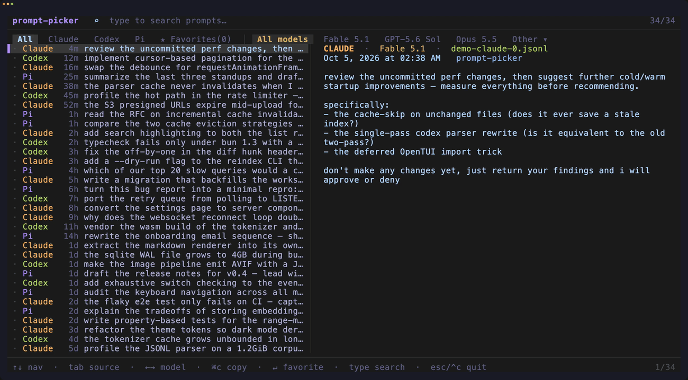
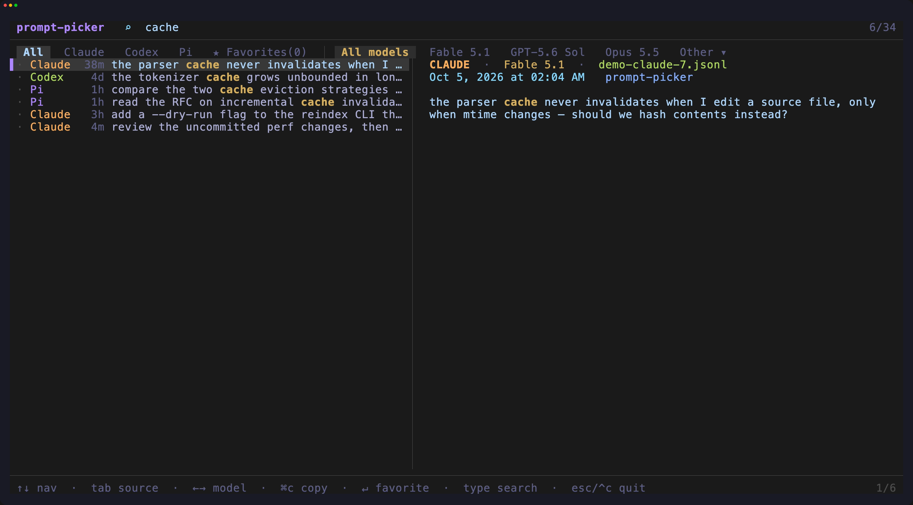
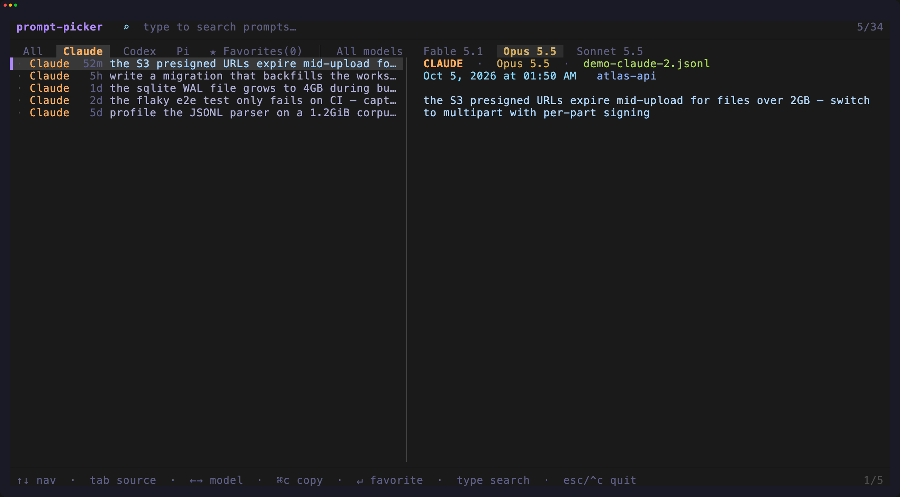
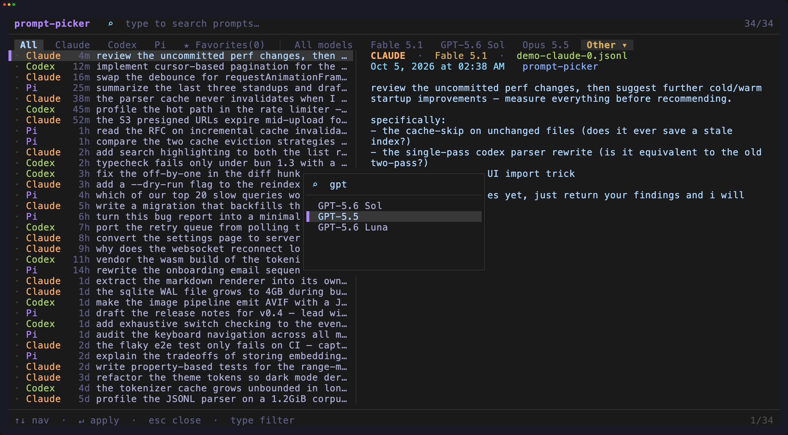
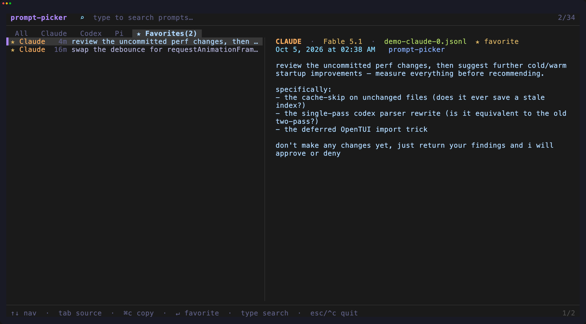

# prompt-picker

A fast TUI and CLI for searching every prompt you've sent to your coding agents.

Supports **Claude Code**, **Codex (TUI and GUI)**, and **Pi** out of the box.
Anything else is a [few lines of config](#make-it-yours) away.
Built with [OpenTUI](https://github.com/sst/opentui), runs on Bun.



- **Live search** across every session, with matches highlighted in the list and the detail pane
- **Filter by source and model.** Model tabs come from your own history, newest first
- **Star the good ones** and find them later in Favorites
- **`pk ls`** for scripts and agents: the same data, as plain text or JSONL
- **Make it yours**: add your own [filters](#custom-filters) and [sources](#custom-sources) in one `config.ts`, built on the same API as the built-ins

| Search, highlighted | Filter by model |
| :-----------------: | :-------------: |
|  |  |
| **Pick from every model you've used** | **Favorites** |
|  |  |

## What it shows

Only **prompts you actually typed.** Tool results, slash-command
expansions, skill blocks, injected file/branch/compaction context, system
reminders, and shell (`!`) commands are all filtered out at parse time.

Two more kinds are kept but hidden unless you ask for them:

| Tag | Meaning | Opt in |
| --- | ------- | ------ |
| `agent` | written by an agent or app, not you (subagent transcripts, SDK sessions) | `--agents` |
| `unsent` | never got a reply (session killed, quit, or errored) | `--unsent` |

| Source | Location |
| ------ | -------- |
| Claude Code | `~/.claude/projects/*/*.jsonl` |
| Codex | `~/.codex/sessions/**/*.jsonl` |
| Pi | `~/.pi/agent/sessions/*/*.jsonl` |

The model a prompt ran on is read from the **assistant reply** (Claude/Pi) or
the **turn context** (Codex).

## Usage

```bash
git clone https://github.com/avgvstvs96/prompt-picker
cd prompt-picker

bun start
```


| Key | Action |
| --- | ------ |
| type | search prompt text (live) |
| `↑` `↓` / `Ctrl-P` `Ctrl-N` | move selection |
| `PgUp` `PgDn` | page |
| `Tab` / `Shift-Tab` | cycle source: All · Claude · Codex · Pi · ★ Favorites |
| `←` `→` | cycle model filter (derived from what's loaded, most recent first) |
| `Enter` / `Ctrl-S` | star / unstar the selected prompt |
| `Enter` on `Other` chip | open the model picker (type to filter, `↑` `↓` select, `Enter` apply) |
| `Ctrl-U` | clear search |
| `Esc` / `Ctrl-C` | close the model picker if open, otherwise quit |


> [!NOTE]
> The model filter tabs are derived from whatever models show up in the
> current view (any source, including All and Favorites) and only appear
> once 2+ distinct models are present, ordered by most recent use. Beyond
> the first 3 they fold behind an `Other` chip — `Enter` on it opens a
> searchable picker of every model in the view.

## CLI

Installs two names for the same command: `prompts` (explicit) and `pk`
(short). Use whichever fits; every example below works with either.

`pk` on a real terminal launches the TUI. Piped or redirected (how LLMs run
it), it lists recent prompts and exits — built for agents to grep/read
without spending context on a UI. Any positional args, or an explicit `ls`,
also force list mode.

```bash
pk                          # TTY: TUI · piped: same as `pk ls`
pk fix the flaky test       # search
pk ls -s 24h                # last day, newest first
pk ls -s 3                  # bare number = days, same as -s 3d
pk ls --source codex        # one source
pk ls -m opus                # model filter, see rule below
pk ls --json --since 1w > out.jsonl
pk ls -s 1 -c                # compact headers
```

Flags: `--since`/`-s <n>h|d|w|<n>` (default `3d`; a bare number means days —
`-s 3` ≡ `-s 3d`), `--source <id>`, `--model`/`-m <q>`, `--json` (JSONL, one
`Prompt` per line), `--raw` (skip config filters — custom sources still
load), `--compact`/`-c` (session id only, no `--json`), `--agents` (include
prompts written by agents and apps — subagent transcripts, SDK-driven
sessions — hidden by default and marked `agent` in the header), `--unsent`
(include prompts that never got a reply — killed, quit, or errored
sessions — hidden by default and marked `unsent`). Results are capped at
100, newest/most-relevant first.

Each prompt is printed under a one-line header:

```
── claude · Fable 5 · prompt-picker · Jul 21 14:32 · 019f4aec-4067-426b-95da-05acbc07b563
prompt text...
```

`source · model · project · short date/time · session id`. The model is
omitted when `-m`/`--model` narrowed the results (redundant at that point).
`--compact` shrinks the header to just the session id, prefixed with the
source unless `--source` was already given:

```
── claude · 019f4aec-4067-426b-95da-05acbc07b563   # default compact
── 019f4aec-4067-426b-95da-05acbc07b563            # --source claude -c
```

`--model` matches substrings of the model label (`-`, `.`, and space are
interchangeable, so `opus-4.7` and `opus 4.7` are the same query). A query
with no digits keeps only the highest matching version — `-m gpt` picks the
newest GPT release, not every one you've ever used.

Config filters (see below) apply by default; `--raw` skips them.

## Make it yours

Everything is configured from one file, `~/.config/prompt-picker/config.ts`.
It's plain TypeScript, so a filter or a source can be anything you can write
as a function.

Claude, Codex, and Pi aren't special. They're declared with the same
`defineFileSource` / `makePrompt` API your config gets, so anything a
built-in can do, your config can do too. The demo above is an example:
[its config](demo/config/prompt-picker/config.ts) swaps out the built-ins
for a source of fake prompts.

### Custom filters

Export a `filters` array of predicates. A prompt is shown only if
**every** filter returns true for it.

```ts
// ~/.config/prompt-picker/config.ts
import type { Filter } from "prompt-picker";

export const filters: Filter[] = [
  (p) => p.text.length > 8,              // drop throwaway prompts
  (p) => p.ts > Date.now() - 90 * 864e5, // only the last 90 days
  (p) => p.project !== "client-work",    // keep one repo out of view
];
```

Each predicate receives a full [`Prompt`](src/types.ts) (`text`, `source`,
`model`, `ts`, `project`, …), so you can filter on anything.

Filters run at load time and never touch the cache, so edits take effect
on the next launch with no reindex. A broken config is reported to stderr and
otherwise ignored.

### Custom sources

Using an agent that isn't built in? Teach prompt-picker to read it. Export a
config **factory** from `config.ts`: it receives the source API and returns
`{ filters, sources, includeBuiltins }`.

`defineFileSource` scans files on disk and parses them into prompts. Use
`makePrompt` to fill in stable ids, timestamps, project names, and model
labels for you:

```ts
// ~/.config/prompt-picker/config.ts
import type { ConfigApi } from "prompt-picker";

export default ({ defineFileSource, makePrompt }: ConfigApi) => ({
  sources: [
    defineFileSource({
      id: "cursor",
      label: "Cursor",
      color: "#7aa2f7",   // optional tab/badge color
      root: "~/.cursor/chats",
      glob: "**/*.jsonl",
      parse({ file, raw }) {
        return raw
          .split("\n")
          .flatMap((line, lineNumber) => {
            if (!line.trim()) return [];
            const event = JSON.parse(line);
            if (event.role !== "user") return [];
            return makePrompt({
              source: "cursor",
              file,
              line: lineNumber,
              text: event.content,
              ts: event.timestamp,
              cwd: event.cwd,
              sessionId: event.session_id,
              model: event.model,     // formatted into a display label
            });
          });
      },
    }),
  ],
});
```

For prompts that don't come from files on disk (generated data, a SQLite
history, an API), use `defineSource` and return the prompts directly:

```ts
import type { ConfigApi } from "prompt-picker";

export default ({ defineSource, makePrompt }: ConfigApi) => ({
  sources: [
    defineSource({
      id: "notes",
      label: "Notes",
      async load() {
        return [
          makePrompt({
            source: "notes",
            file: "manual",
            text: "Review this architecture for accidental complexity.",
            ts: Date.now(),
          }),
        ];
      },
    }),
  ],
});
```

Custom sources are merged after the built-ins and each gets its own tab. The
model filter tabs appear automatically once a view has 2+ distinct models,
no configuration needed. Return `includeBuiltins: false` to replace the
built-in sources entirely — useful for a demo dataset:

```ts
export default ({ defineSource, makePrompt }: ConfigApi) => {
  const demo = Bun.argv.includes("--fake-prompts");
  return {
    includeBuiltins: !demo,
    sources: demo ? [/* defineSource(...) */] : [],
  };
};
```

File sources are cached by size + mtime per file; `defineSource` loaders run on
every launch. A broken source is reported to stderr and skipped.

## Performance

Parsed prompts are cached at `~/.config/prompt-picker/index-cache.json`, keyed
by each source file's size + mtime, so only changed sessions are re-parsed on
launch. Search and filtering run in-memory over the full set on every keystroke.

Favorites persist to `~/.config/prompt-picker/favorites.json`.

---

Built by [Bassim](https://x.com/avgvstvs96)
